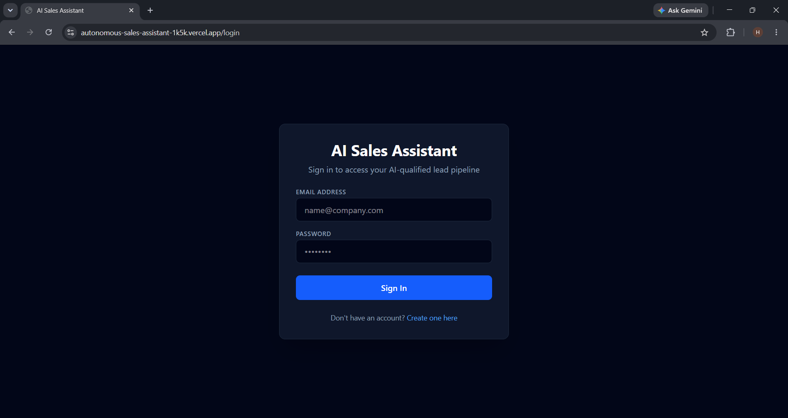
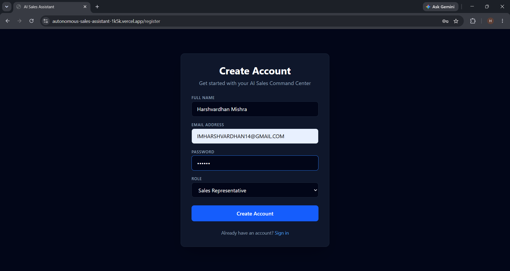
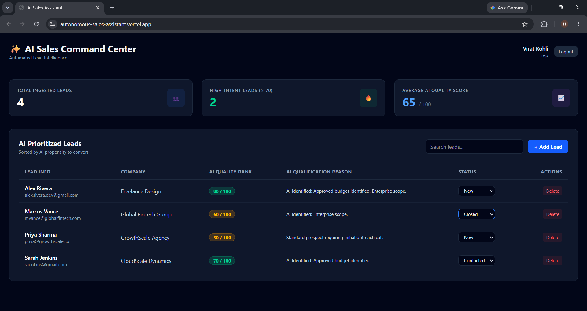

# 🚀 Autonomous Sales Assistant

An end-to-end, AI-native B2B lead management and sales orchestration platform built to transform unstructured prospect data into qualified pipeline strategy, structured scoring, and actionable outreach.


---

## 📌 Executive Summary

The Autonomous Sales Assistant bridges LLM-based reasoning with automated enterprise workflows to replace manual, rules-based CRM entry. Leads submitted through the web dashboard are scored and qualified in real time by a resilient, tiered AI pipeline with schema-validated outputs; leads submitted through the standalone n8n automation hub are processed and logged independently across Google Sheets, Discord, and MongoDB. Both paths persist to the same MongoDB Atlas cluster, giving the team a single source of truth regardless of how a lead enters the system.

---

## 📸 Application Preview

<p align="center">
  <b>User Authentication Boundary</b><br><br>
  
  &nbsp;
  
</p>

<br>

<p align="center">
  <b>Real-Time Sales Intelligence & Lead Management Dashboard</b><br><br>
  
</p>

---

## 🌐 Live Production Links

* **Live Web Application:** [autonomous-sales-assistant-1k5k.vercel.app](https://autonomous-sales-assistant-1k5k.vercel.app)
* **Backend API Gateway:** `https://autonomous-sales-assistant.onrender.com`

---

## 🏗️ Technical Architecture & Stack

The platform is engineered using a decoupled architecture to ensure operational reliability, minimal latency, and strict schema validation across all stages.

* **Automation & AI Orchestration:** n8n Workflow Automation, Custom Webhook Listeners, LLM API Interfaces
* **Backend REST API:** Node.js, Express.js (ES Modules), JWT Authentication, Helmet HTTP Security, Rate Limiting Middleware
* **Automated Testing & CI/CD:** Jest, Supertest integration test suite, Automated GitHub Actions Workflow (`.github/workflows/ci.yml`)
* **Frontend Application:** React 19, Vite, Tailwind CSS, Lucide Icons, React Router DOM
* **Database & Persistence:** MongoDB Atlas (Mongoose ODM)
* **Production Deployment:** Vercel (Frontend Single Page Application), Render (Backend Express Web Service)

---

## 🔄 System Architecture

> **Architecture note:** The n8n automation hub and the Express API are two **independent entry points** into the same MongoDB Atlas cluster — not a single chained pipeline. A lead can enter the system through the React dashboard (scored by the Express API's tiered AI service) or through an external webhook into n8n (scored and logged by the n8n workflow). This was a deliberate decoupling decision, not a request/response relay between the two.

```
      [ Lead via Dashboard ]                    [ Lead via External Webhook ]
              │                                            │
              ▼                                            ▼
 ┌──────────────────────────┐                 ┌──────────────────────────┐
 │      Express REST API     │                 │      n8n Automation Hub  │
 │  JWT Auth · Tiered AI     │                 │  Webhook → Gemini →      │
 │  Scoring (see below)      │                 │  Sheets / Discord Log    │
 └──────────────────────────┘                 └──────────────────────────┘
              │                                            │
              └─────────────────┬──────────────────────────┘
                                 ▼
                    ┌──────────────────────┐
                    │   MongoDB Atlas DB   │
                    └──────────────────────┘
                                 │
                                 ▼
                    ┌──────────────────────┐
                    │   React / Vite UI    │
                    └──────────────────────┘
```

### 1. Express API: Tiered, Schema-Validated AI Scoring
Every lead created through the dashboard is scored by a resilient three-tier fallback chain, each output validated against a strict Zod schema (`{ score, summary }`) before it's trusted or persisted:

1. **n8n webhook** (if configured) — attempts to delegate scoring to the automation hub.
2. **Direct Gemini call** — the primary scoring path, evaluating lead fit against ICP criteria and generating a plain-language rationale.
3. **Deterministic keyword heuristic** — a rules-based fallback if no AI response is available, so lead creation never fails outright.

The tier that actually produced a given score is persisted (`aiSource`) and shown next to the AI's reasoning (`aiSummary`) directly in the dashboard, so every score is auditable back to its source.

### 2. n8n Automation Hub: Independent Webhook Ingestion
A separate n8n workflow (`workflow.json`) provides a no-code entry point for leads arriving from external sources (webhooks, CRM integrations) outside the dashboard:
* **Asynchronous webhook ingestion** — captures inbound payloads without touching the Express API.
* **LLM-based scoring** — runs its own Gemini call via the LangChain node to extract a lead score.
* **Multi-destination logging** — appends results to Google Sheets and posts notifications to Discord, then writes the record to MongoDB.

### 3. Full-Stack Application & Data Layer
* **Express.js API Engine:** Implements modular routes (`/api/auth`, `/api/leads`) secured by `JSON Web Tokens (JWT)`.
* **Reliable Data Persistence:** Uses MongoDB Atlas document modeling to maintain historical lead interaction logs, score breakdown records, and account credentials.
* **Responsive Client Dashboard:** Built with React 19 and Tailwind CSS to provide sales representatives with real-time analytics, filtering, and execution interfaces.

### 4. Production Engineering & Deployment
* **Client (Vercel):** Deployed with Vite root-directory isolation (`/client`) and automated CI/CD builds triggered on main branch updates.
* **Server (Render):** Hosted as an active Express web service listening on dynamic environment ports (`process.env.PORT`) with encrypted environment variables (`MONGO_URI`, `JWT_SECRET`), and fail-loud startup checks that halt the process if required secrets are missing.

---

## 🧪 Testing & CI/CD Pipeline

The backend API includes a hermetic Jest + Supertest integration suite that runs against an in-memory MongoDB instance (`mongodb-memory-server`) — no external database dependency, no skipped assertions. Coverage includes the full auth lifecycle, a privilege-escalation regression test, and an end-to-end lead scoring flow (create → fetch → delete).

To run the test suite locally:

```bash
cd server
npm test
```

Continuous Integration is enforced via GitHub Actions (`.github/workflows/ci.yml`) on every push and pull request to `main`.

---

## ⚡ Local Development & Setup

### Prerequisites
* Node.js (v20+ recommended)
* MongoDB Atlas Cluster or Local MongoDB Instance
* Git

### Step-by-Step Installation

1. **Clone the Repository:**
   ```bash
   git clone https://github.com/harshvardhanongithub/autonomous-sales-assistant.git
   cd autonomous-sales-assistant
   ```

2. **Configure Environment Variables:**
   Copy the example env files and fill in your own values — never commit real credentials:
   ```bash
   cp server/.env.example server/.env
   cp client/.env.example client/.env
   ```
   `server/.env` requires:
   ```env
   PORT=5001
   MONGO_URI=your_mongodb_connection_string
   JWT_SECRET=your_jwt_secret_key
   GEMINI_API_KEY=your_gemini_api_key
   N8N_WEBHOOK_URL=your_n8n_webhook_url   # optional — omit to skip tier 1
   ```
   `client/.env` requires:
   ```env
   VITE_API_BASE_URL=http://localhost:5001
   ```

3. **Install Dependencies:**
   ```bash
   # Install backend dependencies
   cd server && npm install && cd ..

   # Install client dependencies
   cd client && npm install && cd ..
   ```

4. **Launch Local Servers:**
   * **Backend:** `cd server && npm run dev` (serves on `http://localhost:5001`)
   * **Frontend:** `cd client && npm run dev` (serves on `http://localhost:5173`)

---

## 🌐 Live Production Links

* **Live Web Application:** [https://autonomous-sales-assistant-1k5k.vercel.app](https://autonomous-sales-assistant-1k5k.vercel.app)
* **Backend API Gateway:** [https://autonomous-sales-assistant.onrender.com](https://autonomous-sales-assistant.onrender.com)

---

## 📄 License
This project is licensed under the [MIT License](LICENSE).
